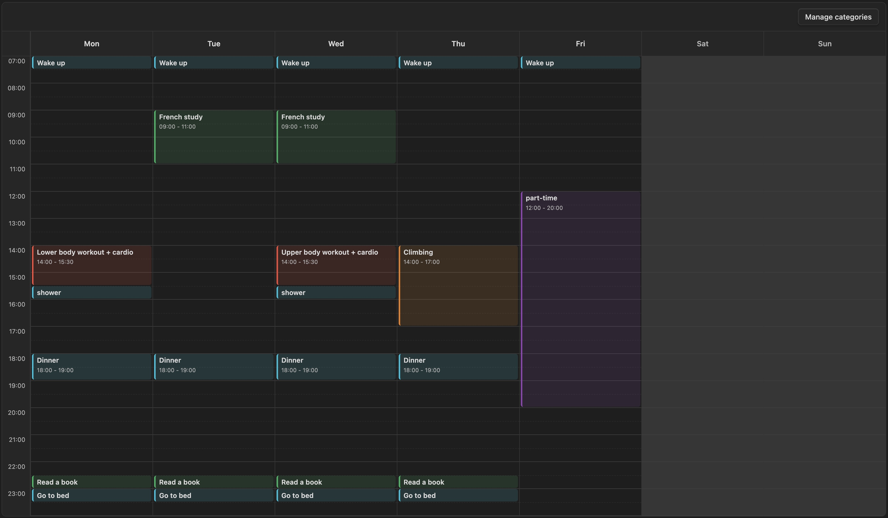

# Weekly Routine Planner

An Obsidian plugin for planning weekly routines with a timetable-style editor and a fenced `weekly-routine` block.



It is meant for recurring weekly structure, not dated calendar events or one-off schedules. The plugin is currently desktop-only.

Start hour, end hour, and hour height are configured in the plugin settings.

## Note Format

~~~md
```weekly-routine
```
<!-- weekly-routine:start -->
- [s-1] Monday 08:00-08:30 | Wake up | #daily-routine
-
<!-- weekly-routine:end -->
~~~

The fenced code block marks the note as a weekly routine planner note.
The plugin only writes inside the region between `<!-- weekly-routine:start -->` and `<!-- weekly-routine:end -->`, so the rest of the note stays untouched.

Each routine line is stored as:

~~~md
- [event-id] Day HH:MM-HH:MM | Title | #category-tag
~~~

The `event-id` always starts with `s-` and must be unique within the note. When creating a routine, the "New routine" popup lets you type your own ID suffix (e.g. `s-work`, `s-gymam`) instead of the auto-suggested one — letters and digits only. Saving with an ID that's already used shows an error instead of silently overwriting it.

## Filtering by Category

Use the `Filter` button in the timetable toolbar to show only routines from selected categories (or only uncategorized ones). The selection is per view and resets when the note is reopened.

You can also set a default filter directly in the fenced block by adding a `filter:` line listing category names or ids in brackets:

~~~md
```weekly-routine
filter: [study, part-time-work]
```
~~~

This preselects those categories when the timetable loads; you can still change the selection from the toolbar afterward.

## Category Management

Categories are managed by the user from the timetable UI:

1. Click `Manage categories` in the timetable toolbar.
2. Add, rename, recolor, or delete categories.

The same category manager is also available while creating or editing a routine.

Category definitions are saved in the plugin's data/settings, not directly in the note.
Inside the note, a routine only stores the selected category as a tag such as `#daily-routine`.

The category id is generated from the category name, so `Daily Routine` becomes `#daily-routine`.
If you rename a category, the plugin updates matching tags in the managed routine block.
If you delete a category, the plugin removes that category tag from affected routines.

## Installation

You can install this plugin directly from the Obsidian Community Plugins directory:

1. Open Obsidian **Settings** → **Community plugins**.
2. Turn off Safe Mode if you haven't already.
3. Click **Browse** and search for **Weekly Routine Planner**.
4. Click **Install** and then **Enable**.

## Manual Installation

If you prefer to install the plugin manually from this repository:

1. Clone or download this repository.
   ```bash
   git clone https://github.com/lylaminju/weekly-routine-planner.git
   ```
2. Locate your vault's plugin folder. It is at `<your-vault>/.obsidian/plugins/`. Create the `plugins` directory if it does not exist.
3. Copy `main.js`, `manifest.json`, and `styles.css` from the cloned repository into a new folder:
   ```bash
   mkdir -p <your-vault>/.obsidian/plugins/weekly-routine-planner
   cp main.js manifest.json styles.css <your-vault>/.obsidian/plugins/weekly-routine-planner/
   ```
4. Add `"weekly-routine-planner"` to the array in `<your-vault>/.obsidian/community-plugins.json`. If the file does not exist, create it with:
   ```json
   ["weekly-routine-planner"]
   ```
5. Restart Obsidian (or reload without cache: `Ctrl/Cmd + Shift + R` on desktop).
6. Go to **Settings → Community plugins**, find **Weekly Routine Planner** in the list, and enable it.